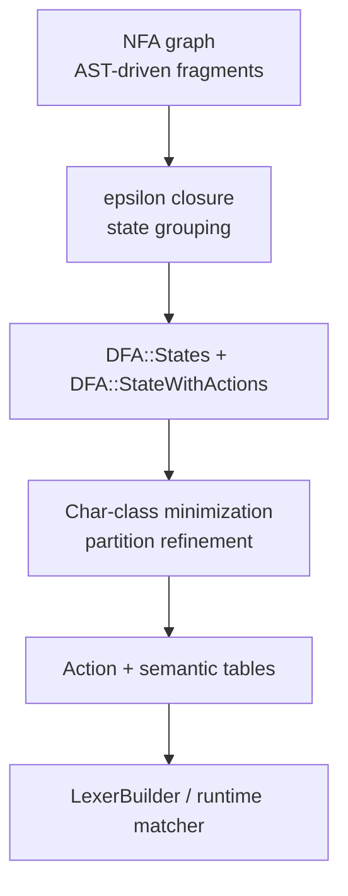
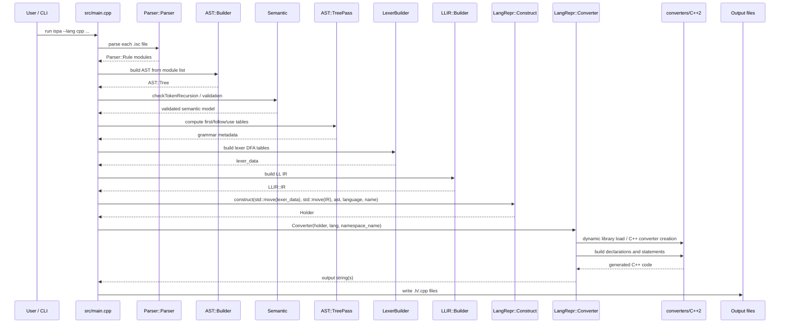

# ISPA Parser Architecture

## 1. Executive Summary

ISPA is a grammar-driven parser and lexer generator written in modern C++20/C++23. The engine takes raw `.isc` grammar source files, builds an AST with semantic metadata, derives lexical and parser state machines, and emits typed IR that can be rendered into target language code. The project is intentionally layered: parsing and AST construction live in `src/`, the state machine and NFA/DFA logic sits around `src/NFA.cppm`, `src/DFA/*`, and `src/LangAPI.cppm`, while target generation is expressed via `LangRepr` and the `converters/` modules.

The main executable (`src/main.cpp`) orchestrates the full pipeline: file discovery, grammar parsing, AST construction, semantic validation, lexer generation, LLIR construction, and final target emission. The central design idea is that source grammars are first compiled into a normalized IR (`LangAPI::Declarations`, `LangAPI::Statements`, `LangAPI::Expression`, and associated runtime values) and then converted into C++ code via a plugin-like converter layer.

At a high level, ISPA is both:

- a parser generator for user-defined grammars; and
- a platform-independent IR and conversion framework for backend emitters.

This dual shape is visible in the codebase: the `src/` tree focuses on analysis and intermediate representation, while `converters/` and `src/LangRepr/` focus on target rendering.

For broader design notes, see the conceptual documentation under `concept/`, which describes planned module import semantics and advanced lexer/parser capabilities that are not yet fully wired into the production pipeline.

## 2. System Architecture Diagram

```mermaid
flowchart LR
    A[Raw grammar source\n.isc files / directories] --> B[main.cpp\nbootstrap + orchestration]
    B --> C[Parser::Parser\nsource grammar parse]
    C --> D[AST::Builder\nbuild Rule/Token tree]
    D --> E[Semantic checks\nrecursion / validation]
    E --> F[AST::TreePass\nfirst/follow/use analysis]
    F --> G[LexerBuilder\nDFA/NFA lexical tables]
    F --> H[LLIR::Builder\nIR for parser rules]

    G --> I[NFA.cpp / DFA engine\nstate machine synthesis]
    H --> J[LangAPI IR\nExpression / Statements / Declarations]
    J --> K[LangRepr::Construct\nIR shaping]
    K --> L[LangRepr::Converter\nbackend dispatch]
    L --> M[converters/C++/ + C++2\nC++ code generation]
    M --> N[Generated header/source output]

    I -. table-driven lexical transitions .-> G
    J -. typed semantics .-> M
```



Notes:

- `NFA.cpp` is the central state-machine synthesis layer for token and grammar recognition.
- `src/LangAPI.cppm` acts as the IR vocabulary used across AST, LLIR, and converter stages.
- The target generation layer is organized around `converters/C++/` semantics, with the active C++ backend currently implemented in `converters/C++2/*.cpp`; CMake also includes `converters/C++` in the include path for this target layer.

## 3. Module & Interface Breakdown

### 3.1 Module layout

The codebase is split between interface modules (`*.cppm`) and implementation files (`*.cpp`). The module system is enabled in `CMakeLists.txt` with `CMAKE_CXX_MODULE_STD ON` and `CMAKE_CXX_SCAN_FOR_MODULES ON`.

Core module families:

- `src/*.cppm`: engine-level interfaces (`LangAPI`, `NFA`, `Semantic`, `DFA`, `LLIR`, `LexerBuilder`, `args`, `init`, etc.)
- `src/AST/*.cppm`: AST API, builder, tree analysis, and pass logic
- `src/LangRepr/*.cppm`: conversion from internal IR to target-specific structures
- `src/DFA/*.cppm`: DFA/NFA state and closure machinery
- `parser/*.cppm`: parser runtime and stdlib modules
- `converters/*.cppm`: generic converter interfaces and writer abstractions
- `converters/C++2/*.cppm`: concrete C++ emitter interfaces and helper functions
- `concept/*.md`: design docs for planned grammar/module features rather than built code

### 3.2 `.cppm` vs `.cpp`

The project follows a strict split:

- `.cppm` files declare exported module interfaces, public types, and function signatures.
- `.cpp` files define the actual work: parser logic, semantic traversal, DFA generation, and converter implementations.

Examples:

- `src/LangAPI.cppm`: central IR vocabulary (`ValueType`, `RValueType`, `Statement`, `Declaration`, `FunctionCall`, etc.)
- `src/LangAPI.cpp`: implements equality, printing, and conversion helpers for those types
- `src/NFA.cppm`: defines the NFA graph, token bindings, state tables, and transition types
- `src/NFA.cpp`: implements state fragment construction, epsilon closures, and semantic action wiring
- `src/AST/Tree.cppm`: public AST object model and API
- `src/AST/Tree.cpp`: computes FIRST/FOLLOW sets, use tables, and nullable analysis
- `src/LangRepr/Construct.cppm`: declares the construction pipeline from lexer + IR + AST to a holder
- `src/LangRepr/Construct*.cpp`: implement type construction and code generation preparation
- `src/LangRepr/Converter.cppm`: dispatches generation by target language via plugin loading
- `converters/Converter.cppm`: base converter class definitions for `LexerConverter_base`, `LLConverter_base`, and `LRConverter_base`
- `converters/C++2/*.cppm`: C++-specific conversion interfaces (type conversion, declarations, statements, initialization)
- `converters/C++2/*.cpp`: concrete C++ code generation logic

### 3.3 `concept/` and architecture intent

The `concept/` directory is not a runtime build target; it is an architectural design archive describing the desired semantics of advanced grammar features:

- `MODULES.md`: module import and namespacing strategy
- `LEXER_SEMANTIC_BUILDER.md`: DFA+semantic action design for context-sensitive lexing
- `FAIL_BLOCKS_AND_ADVANCED_RULES.md`: recovery and rule-level errors
- `TEMPLATES_AND_INHERITANCE.md`: generic template/inheritance grammar design

This directory matters because the actual engine is implementing a substantial IR-first architecture that is broader than the current stable feature set. The concepts document the intended extension points and the rationale behind the current `LangAPI` and NFA abstractions.

## 3.4 Direct NFA and DFA Architecture

The lexical engine is not just a flat table generator; it is a two-phase automata pipeline built around `NFA.cppm` and `DFA/*`.

### 3.4.1 NFA model

`NFA` is the graph builder for grammar fragments. In `src/NFA.cppm`, the public type exports important data used throughout lexing and parser construction:

- `TransitionKey = std::variant<stdu::vector<std::string>, char>`
- `Action = { UNDEF, BEGIN, END, PUSH, SNAPSHOT, SNAPSHOT_APPLY, SNAPSHOT_APPLY_END }`
- `SemanticAction = { UNDEF, REDUCE }`
- `ActionState` and `SemanticState` capturing both structural transitions and semantic callbacks
- `TokenBinding` with `token_id`, optional `target_semantic_state`, optional `reduce_rule_id`, and `is_unique_representation`

The actual `NFA::state` object is intentionally rich:

- `transitions`: map from symbol to next NFA transitions
- `actions`: action chain for BEGIN/END/PUSH or semantic reduction callbacks
- `accept_binding`: token/rule acceptance metadata
- `epsilon_transitions`: closure edges used during DFA construction

This is not a minimal regex NFA; it includes explicit grammar-aware actions for token capture, group tracking, snapshot handling, and end-of-token reductions. That is why the NFA layer is structurally tied to the AST and semantic metadata rather than just a character DFA.

### 3.4.2 NFA-to-DFA conversion path

The `DFA` layer (`src/DFA/DFA.cppm`, `src/DFA/API.cppm`, `src/DFA/States.cppm`, `src/DFA/Closure.cppm`) converts the epsilon-closure graph into deterministic states. The key runtime structures are:

- `DFA::StateWithActions`: deterministic state with `nfa_states`, `transitions`, and optional `accept_action`
- `DFA::TransitionTarget`: a `std::variant` of `NFA::DFATarget`, `NFA::ActionTarget`, and `NFA::SemanticTarget`
- `DFA::ActionSequence`: ordered action chain plus a terminal DFA target
- `DFA::StateOffsetMapper`: resolves NFA/DFA/action index offsets into a unified runtime table

The conversion pipeline is meant to separate three concerns:

1. pure DFA transitions over symbol classes (`DfaType::Char`, `Token`, `Multi`)
2. action transitions for matcher semantics (BEGIN/END/PUSH/SNAPSHOT)
3. semantic reductions that land in target parser/IR states

This is a direct expression of the project’s architecture: lexical acceptance is not just token recognition, but a state machine that carries action semantics alongside transitions.



### 3.4.3 DFA runtime model

The runtime uses a shared deterministic state model together with action tables:

- `DFA::State<>` stores accepted transitions and optional accept actions
- `DFA::StateWithActions` stores the action-bearing version used during conversion
- `DFA::CharClassTable` maps each byte to a class id so states can use compact per-class transition vectors
- `DFA::ClassTransitions` is `std::vector<TransitionTarget>` indexed by class id, not raw byte value

This makes the DFA architecture efficient and allows the runtime to encode lexical semantics compactly while still preserving access to grammar-targeted action transitions. In other words, the DFA is not just a token recognizer; it is a deterministic runtime for the lexer semantics layer.

## 3.5 LangAPI Architecture

`src/LangAPI.cppm` is the central typed IR vocabulary. It defines the “language of the intermediate representation” used by AST builders, LLIR production, and the target emitters. The architecture is intentionally explicit and strongly typed rather than using `std::any` or unstructured runtime metadata.

### 3.5.1 Type lattice

`LangAPI` exports a rich type hierarchy and enumerations:

- `ValueType`: static semantic categories (`Char`, `Int`, `Bool`, `String`, `Array`, `Map`, `Symbol`, `Variant`, `Reference`, etc.)
- `RValueType`: runtime value variants (`Char`, `Int`, `Bool`, `String`, `Array`, `Pos`, `Symbol`, `GetVariant`, `CheckVariant`, `IspaLibDfaSpan`, etc.)
- `ExpressionValueType`: expression-level operations (`FunctionCall`, `Return`, `Break`, `Continue`, `DfaLookup`, `ReportError`, `Lambda`, etc.)

The layered relation is intentionally ordered:

- `RValue` is the runtime value level
- `ExpressionValue` is the expression payload level
- `Expression` is a sequence of expression values
- `Statement` is a control-flow or executable construct
- `Statements` is a sequence of statements
- `Declaration` and `Declarations` are the top-level IR object category

This is represented by the promotion templates at the top of `LangAPI.cppm`:

- `promote_to<RValue>` -> `ExpressionValue`
- `promote_to<ExpressionValue>` -> `Expression`
- ... up to `Declarations`

This provides a coercion lattice for building a typed IR without the emitter needing to reinterpret loose dynamic objects.

### 3.5.2 Value and expression model

The IR is built around concrete shapes like:

- `Char`, `Int`, `Bool`, `Float`, `String`
- `Array`, `FixedSizeArray`, `Map`
- `Symbol`, `StorageSymbol`, `IspaLibSymbol`
- `FunctionCall`, `IspaLibFunctionCall`, `Inheritance`
- `GetVariant`, `CheckVariant`, `MakeTuple`
- `Lambda`, `If`, `While`, `DoWhile`, `Switch`

These types are not just tagged containers; they are semantically rich enough to be rendered directly by the C++ converter. For example:

- `FunctionCall` holds a symbol name and template arguments
- `StorageSymbol` captures path-like storage access and offset expressions
- `GetVariant` and `CheckVariant` explicitly encode runtime variant introspection
- `IspaLibDfaTransition` and related DFA span types capture the lexical runtime model needed by the code generator

That is the core purpose of `LangAPI`: it is the canonical representation between grammar semantics and output languages.

### 3.5.3 `LangAPI::GetVariant` and variant semantics

One of the most important design points in `LangAPI` is the variant-aware IR. `GetVariant` is modelled as a typed runtime expression:

- `std::shared_ptr<Type> type`
- `Expression sym`
- strongly typed value variant payloads for runtime retrieval

Because `GetVariant` and similar types are comparable and printable (`operator==`, `operator<`, `operator<<` are defined in `src/LangAPI.cpp`), they can be embedded inside hashable tables and emitted by the converters without lossy decoding. This is an essential mechanism for carrying runtime type checks, variant access, and Dfa/IR semantics across stages.

## 3.6 LLIR Architecture

The LLIR layer (`src/LLIR/*.cppm`, `src/LLIR/*.cpp`) is the parser-side intermediate representation between the grammar tree and the backend converter. It captures rule-oriented productions and token/lexer metadata, and it is the bridge between the AST and the final generated C++ implementation.

### 3.6.1 LLIR data model

The core LLIR types are defined in `src/LLIR/API.cppm`:

- `DataBlock`: either a regular pair (`LangAPI::Expression`, `LangAPI::Type`) or an enclosed map of name -> pair
- `Production`: a named rule production with a `DataBlock` and `LangAPI::Statements members`
- `DataBlockList`: ordered map keyed by a rule/token name

This small but precise model allows different grammar sections to carry either flat values or structured data blocks, which is important for rules that need typed named members (for example, semantic data extracted from a match sequence).

### 3.6.2 Builder process

`LLIR::Builder` is created in `src/LLIR/Builder.cppm` and implemented in `src/LLIR/Builder.cpp`. It iterates over the AST tree and creates a production for each rule or token:

- it walks each grammar entry in `AST::Tree`
- it filters tokens vs rules via `tokensOnly`
- it constructs `LLIR::RuleBuilder` instances for each name/value pair
- it collects the resulting productions and any DFA set

The final builder result is:

```cpp
auto LLIR::Builder::get() -> IR;
```

which returns an `LLIR::IR` object containing:

- `data`: the production list
- `dfa_collection`: related DFA objects generated during rule construction

This means the LLIR is not just a parser AST; it is a grammar semantics container that includes DFA-backed recognition state when required.

### 3.6.3 IR shape and target coupling

`LLIR::IR` (`src/LLIR/IR.cppm`) stores the authoritative production collection and DFA collection as a compact runtime-friendly object. It exposes methods such as:

- `getDataBlocks()`
- `getData()`
- `getDfas()`
- `operator[]` for direct production lookup

This object is then consumed by `LangRepr::Construct`, which reshapes the produced grammar into the target-adapter `Holder` used by `LangRepr::Converter`. In practice, LLIR is the transition point where the engine stops being grammar-structure-first and becomes code-generation-first.

## 4. State Machine & Execution Lifecycle

### 4.1 Execution flow

The lifecycle is orchestrated by `src/main.cpp` and follows a clear sequence:

1. command-line arguments are parsed and validated
2. input `.isc` files are loaded
3. each file is parsed into `Parser::Rule` objects
4. an `AST::Builder` constructs a normalized AST
5. `Semantic` validates recursion and grammar correctness
6. `AST::TreePass` computes FIRST/FOLLOW and use-set metadata
7. `LexerBuilder` synthesizes DFA tables
8. `LLIR::Builder` creates the LL parser IR
9. `LangRepr::Construct` shapes the IR into a target-agnostic holder
10. `LangRepr::Converter` dispatches to the correct backend module
11. generated text is emitted to header/source files

### 4.2 Sequence diagram



## 5. Memory & Ownership Model

The engine makes deliberate ownership choices:

- `std::shared_ptr` is used for AST nodes, rule members, and strongly shared semantic entities that are frequently referenced across multiple passes and data structures.
- `std::unique_ptr` is used for converter and builder ownership with explicit lifetime boundaries, especially in `LangRepr::Converter` and plugin-managed converter instances.
- plain `std::vector`, `std::unordered_map`, `std::variant`, and custom hashed maps hold local state and table data.
- `std::optional` is used to represent nullable token bindings and state configuration where a value may be absent.

Important examples:

- `AST::Tree` stores `stdu::vector<std::shared_ptr<AST::RuleMember>>` to allow multiple analysis passes to reference the same underlying grammar structure.
- `NFA::state` stores `std::variant`-based transition and action payloads, and `NFA::ActionChain` is a vector of action/semantic variants.
- `LangRepr::Converter` uses `std::unique_ptr<::Converter::Declarations, void(*)(...)>` and `std::unique_ptr<::Converter::Statement, void(*)(...)>` to safely manage converter backend objects loaded from a shared library.

### 5.1 Variant-heavy AST and IR design

`LangAPI.cppm` is central to the memory model because it defines the typed IR vocabulary as a hierarchy of value objects. These are not arbitrary `std::any`; they are strongly structured and intentionally comparable.

The key polymorphic pattern is the `std::variant` payload used to model expression content, generic template parameters, and value categories. One of the most significant examples is `LangAPI::GetVariant`:

- `GetVariant` derives from `RValueLevel`
- it carries a `std::shared_ptr<Type>` and a value payload that is itself a variant
- it is used to represent runtime access to variant-typed storage, e.g., retrieving a type-safe value from a dynamically typed slot
- the comparison and streaming operators are defined in `src/LangAPI.cpp`, which makes the runtime representation hashable and printable for tables and IR emission

This is a crucial semantic feature: the engine models both static typing (`Type`) and runtime value semantics (`RValue`, `ExpressionValue`) in one explicit lattice, which lets the converter layer reconstruct code generation without falling back to ad hoc reflection.

### 5.2 Ownership guarantees

The project’s general guarantee is:

- ownership is explicit at API boundaries
- shared state is wrapped in `shared_ptr` when cross-pipeline lifetimes are required
- ephemeral implementation objects are scoped with `unique_ptr` when only one manager owns them
- value objects are copied/moved deliberately and are usually cheap due to their compact, type-tagged design

The resulting model is stable for IR building and code generation, but it still assumes a single build pipeline with controlled object graph lifetime. This is a good fit for a code generator rather than a long-lived runtime service.

## 6. Build & Dependency Structure

### 6.1 CMake build graph

The root `CMakeLists.txt` defines a multi-target structure:

- `ispa_modules` — static module library collecting all exported `.cppm` interfaces and implementation `.cpp` files except `main.cpp`
- `ispa-converter-cpp` — shared library holding the C++ emitter implementation (`converters/C++2/*.cpp`)
- `ispa` — executable entry point (`src/main.cpp`)
- `tests` — GTest-driven validation suite

The module library is built with the C++ module file set:

```cmake
add_library(ispa_modules STATIC)

get_file_range(ISPA_MODULE_INTERFACES
    ${CMAKE_CURRENT_SOURCE_DIR}/src/*.cppm
    ${CMAKE_CURRENT_SOURCE_DIR}/src/runtime/*.cppm
    ${CMAKE_CURRENT_SOURCE_DIR}/parser/*.cppm
    ${CMAKE_CURRENT_SOURCE_DIR}/include/*.cppm
    ${CMAKE_CURRENT_SOURCE_DIR}/converters/C++2/*.cppm
    ${CMAKE_CURRENT_SOURCE_DIR}/converters/*.cppm
    ${CMAKE_CURRENT_SOURCE_DIR}/external/*.cppm
)
```

This pattern ensures the engine compiles in a module-aware way rather than relying on classic header-only inclusion.

### 6.2 Compiler and standard assumptions

The project requires modern compiler support for C++20/C++23 modules:

```cmake
set(CMAKE_CXX_MODULE_STD ON)
set(CMAKE_CXX_STANDARD 23)
set(CMAKE_CXX_STANDARD_REQUIRED ON)
set(CMAKE_CXX_EXTENSIONS OFF)
set(CMAKE_CXX_SCAN_FOR_MODULES ON)
```

The build also sets `__SOURCE_ROOT__`, `PROGRAM_VERSION`, and `DSTD_NO_DEBUG`, and enables `DEBUG` when built in `Debug` mode.

For Clang, the build config explicitly adds:

```cmake
add_compile_options(-stdlib=libc++)
add_link_options(-stdlib=libc++)
```

This is consistent with the repository guidance in `README.md`, which stresses that Clang/libc++ is the expected toolchain on Linux and that the build is not designed to be used with GCC in its current supported path.

### 6.3 External dependencies

The project uses vcpkg and CMake package discovery for external libraries:

- `Boost`
- `yaml-cpp`
- `CLI11`
- a fetched `RopeString` dependency via `FetchContent`

The core library target links to `Boost::boost`, `Rope`, and `CLI11::CLI11`; the test target also links to `GTest` and `yaml-cpp`.

### 6.4 Target generation structure

The code-generation layer is intentionally split:

- `converters/*.cppm` declare generic converter contracts
- `converters/C++2/*.cppm` define the C++ emitter behavior
- `converters/C++2/*.cpp` implement the concrete output rules for declarations, statements, core functions, and initialization
- `src/LangRepr/Converter.cppm` loads the backend library and instantiates declarations/statement conversion objects

This architecture allows multiple backends to share the same IR surface while isolating target-specific formatting behavior. The current project is primarily a C++ generator, but the design is already structured around backend substitution.

## 7. Design Summary

ISPA’s architecture is best understood as a pipeline from grammar text to typed IR to target code:

- raw source in -> `Parser::Parser` -> `AST::Tree`
- AST + semantic analysis -> `NFA/DFA` and `LLIR`
- typed IR -> `LangRepr::Construct` -> `LangRepr::Converter`
- backend -> `converters/C++2` -> generated C++ output

This design keeps lexing, parsing, semantic analysis, and code generation mechanically separate while preserving enough shared type structure for all stages to participate in a single coherent system.

The engine is ambitious and not fully stabilized: the `concept/` documents and the broad `LangAPI`/`NFA` model show a system meant to support more advanced grammar and code generation scenarios than the currently shipping C++ backend alone. Nonetheless, the current architecture is solidly organized around a typed IR and pluggable target emitters, which is the correct foundation for future language backends and grammar features.
